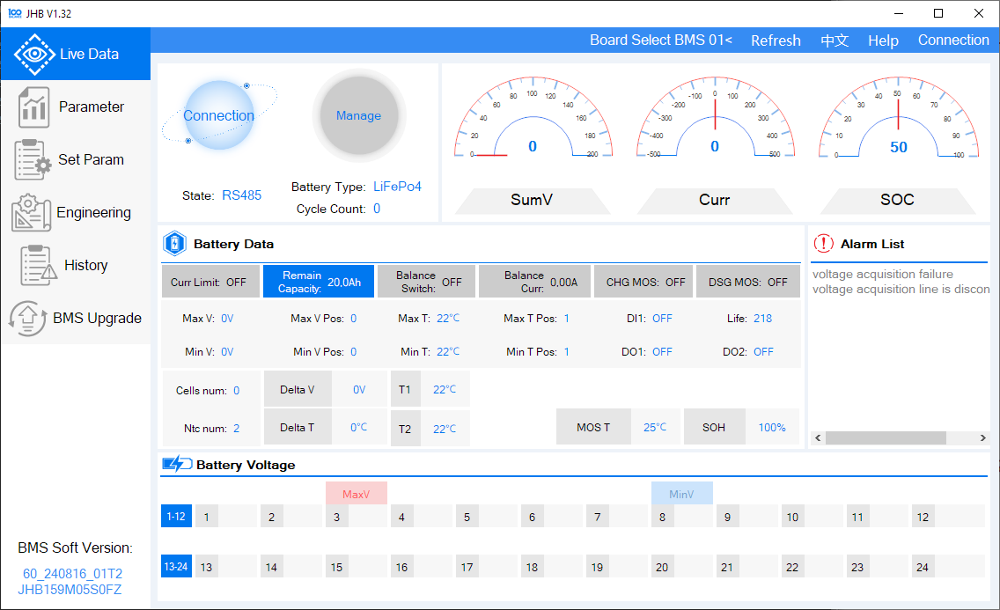
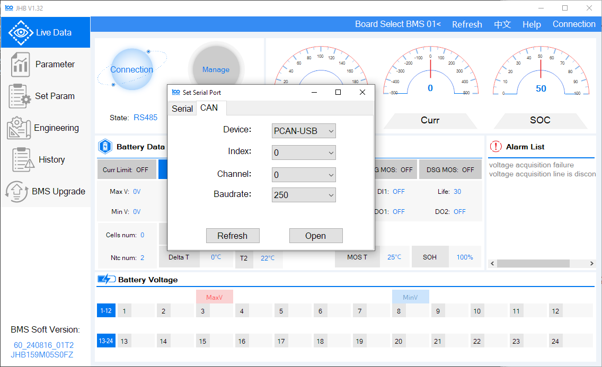
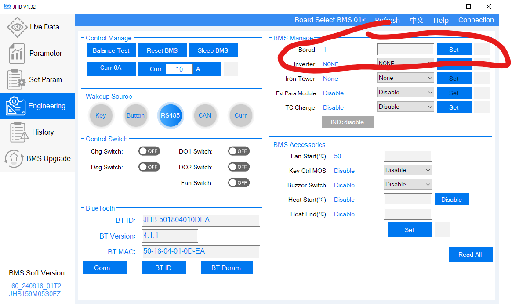
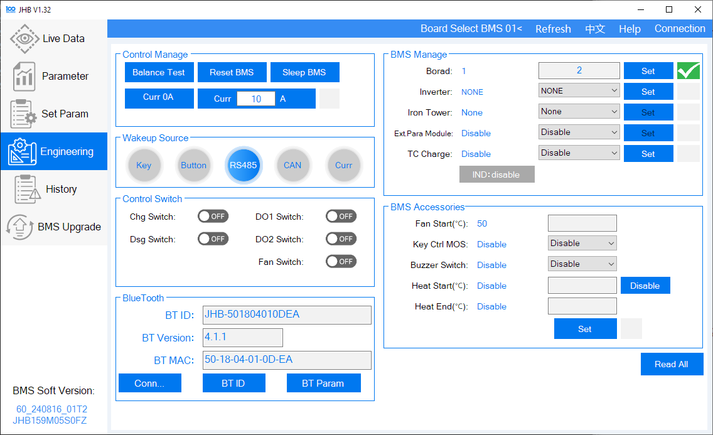
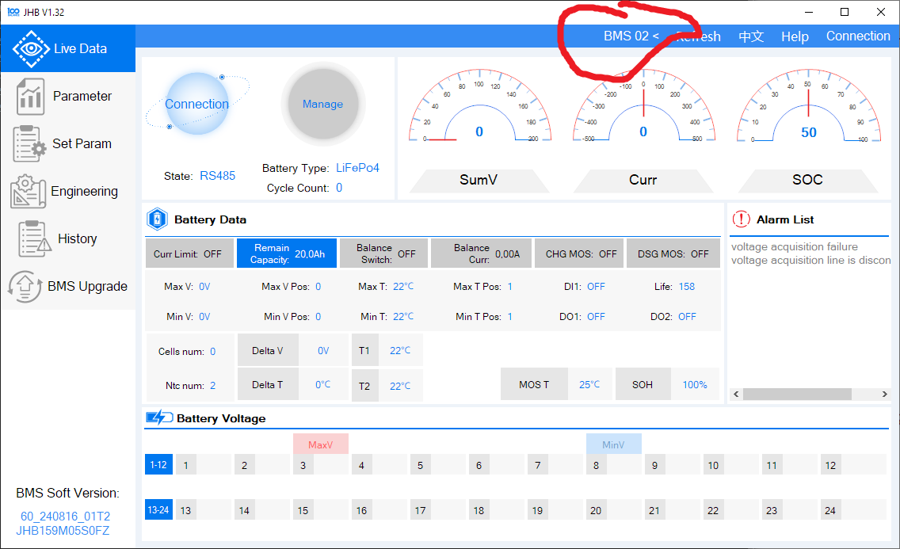
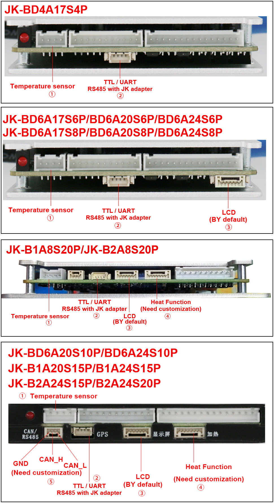

# How to connect and prepare the battery/BMS

> Make sure the data connection from the GX device to the BMS is isolated, see also [galvanic isolation](https://en.wikipedia.org/wiki/Galvanic_isolation).
> Otherwise you can damage your GX device and BMS, since the negative current will flow through the data cable, if the BMS disconnects the negative pole.

Since for some BMS the port labeling is a mess and not reflecting the real situation here are some useful instructions and links.

## UART/TTL (no daisy chain possible)

UART (Universal Asynchronous Receiver-Transmitter) is a serial communication protocol used for communication between devices. TTL (Transistor-Transistor Logic) refers to the voltage levels used in UART communication.

Ensure the voltage levels (5 V or 3.3 V) of your BMS are supported by the USB to UART/TTL adapter. Use an isolated adapter and power it correctly. Most BMS provide battery power `VCC+` on the `+` pole of the UART/TTL connector. Measure it before connecting. You may need a DC to DC converter to match the voltage your isolated adapter needs.

Connect the wires in a device-to-device configuration. The main cable runs from the master (USB to UART adapter) to the BMS and contains three wires:

-   **TX (Transmit)**
-   **RX (Receive)**
-   **GND (common)** for proper reference

The main cable should be shielded to prevent interference. Ensure that the TX of the master is connected to the RX of the BMS and the RX of the master is connected to the TX of the BMS.

Recommended adapters that are high quality and have been tested over a long period:
- [USB SinglePort VE.Direct](https://www.duppa.net/product/usb-singleport-ve-direct/?ref=2892) (affiliate link)
- [USB Quadport VE.Direct](https://www.duppa.net/product/usb-quadport-ve-direct/?ref=2892) (affiliate link)


## RS485/Modbus (daisy chain possible)

> Refer to the [feature comparison](./features.md#bms-feature-comparison) to see which BMS models support daisy chaining.

RS485 is a differential balanced line over twisted pair, capable of spanning up to a few hundred meters. Be aware of voltage drops due to cable resistance and sensor power consumption.

Connect the wires in a device-to-device (daisy chain) configuration:

-   **Avoid star or ring networks** to prevent signal reflections.
-   The main cable runs from the master (USB to RS485 adapter) to all BMS and contains three wires:
    -   **A (DATA-)**
    -   **B (DATA+)**
    -   **GND (common)** for proper reference

The main cable should be shielded. Ideally, the shield is separate from the 0 Volt line (GND), but they can be combined if the shield is free of voltage fluctuations.

Use a termination resistor (120-130 Ω) between A (DATA-) and B (DATA+) if the line is longer than 10 meters.


See also [this page](https://know.innon.com/howtowire-non-optoisolated).

## CAN (daisy chain possible)

> Refer to the [feature comparison](./features.md#bms-feature-comparison) to see which BMS models support daisy chaining.

> Do not forget to set `CAN_PORT` in the `config.ini`.

First, you need to create the correct cable.

### Victron Side

Refer to the [VE.Can to CAN-bus BMS cables manual](https://www.victronenergy.com/live/battery_compatibility:can-bus_bms-cable#pin-out) for instructions.

⚠️ Remember to use a 120 Ω resistor between CAN-H and CAN-L, or use a [VE.Can RJ45 Terminator](https://www.victronenergy.com/accessories/ve-can-rj45-terminator) to terminate the line. Otherwise, it won't work. In some cases, you may also need to terminate the other end of the line.

| Function | Victron VE.Can Side | RJ45 Pinout T-568A | RJ45 Pinout T-568B |
| -------- | ------------------- | ------------------ | ------------------ |
| GND      | Pin 3               | White/Orange       | White/Green        |
| CAN-H    | Pin 7               | White/Brown        | White/Brown        |
| CAN-L    | Pin 8               | Brown              | Brown              |

 

### BMS Side

Check your BMS manual for the correct pinout. If you don't find any, you could try to measure the voltages.

| Function | Voltage to GND |
| -------- | -------------: |
| GND      |            0 V |
| CAN-H    |           +3 V |
| CAN-L    |           +2 V |

### Daisy chain


See also [this page](https://www.lp-research.com/how-to-design-an-efficient-high-speed-can-bus-network-with-lpms-ig1/).

## Bluetooth

No special preparation is required.

## BMS configuration

### Daly BMS

Connect your BMS via the PC software ([BmsMonitor](https://www.dalybms.com/download-pc-software/)) and set the `Sleep time(S)` to `65535` to prevent the BMS from going to sleep.

If you are using multiple batteries you also have to make sure, that the `Battery code` is different on every battery.


#### RS485

> 🌼🔗 Only if you want to connect multiple Daly BMS to the same RS485 adapter 👇

1. Use Daly's [BmsMonitor](https://www.dalybms.com/download-pc-software/) software (only for Windows) to set the board number.
   Using the mobile app `SMART BMS` to set the board number will not correctly set it.

2. Set a different board number for each BMS in the `BMS Tools` software

3. Specify the MODBUS addresses in the `config.ini` at the `BATTERY_ADDRESSES` parameter.

    For example, if you are using three batteries the parameter would be `BATTERY_ADDRESSES = 0x40, 0x41, 0x42`.

    | board number | modbus address |
    | :----------: | :------------: |
    |     `1`      |     `0x40`     |
    |     `2`      |     `0x41`     |
    |     `3`      |     `0x42`     |
    |     `4`      |     `0x43`     |
    |     `5`      |     `0x44`     |
    |     `6`      |     `0x45`     |
    |     `7`      |     `0x46`     |
    |     `8`      |     `0x47`     |
    |     `9`      |     `0x48`     |
    |     `10`     |     `0x49`     |
    |     `11`     |     `0x4a`     |
    |     `12`     |     `0x4b`     |
    |     `13`     |     `0x4c`     |
    |     `14`     |     `0x4d`     |
    |     `15`     |     `0x4e`     |
    |     `16`     |     `0x4f`     |

#### CAN

> 🌼🔗 Only if you want to connect multiple Daly BMS to the same CAN port 👇

1. **Download the Software**

-   Visit [this link](https://www.100balancebms.com/en/download.asp) and download the "PC Host Program for BMS."
-   Extract the downloaded file and run `JHB_serialport.exe`.

    > _Note:_ Windows may block the program. If so, override the warning to proceed.

2. **Start the Software**

-   After launching the program, the main screen should look like this:

    

3. **Establish the Connection**

-   Select the appropriate connection method:
-   If you don’t have a compatible CAN adapter for your PC, use an RS485 adapter instead.
-   Choose the RS485 adapter from the serial port selection and set the baud rate to `9600`.

    > _Note:_ The Peak CAN USB dongle may not work with this version of the software. Alternatively, you can use the older "BMSTool-V1.14.23" software, which is more complex but compatible.

    

4. **View Live Battery Data**

    - Once connected, you should see live values from your battery.

5. **Set the Board Address**

    - Navigate to the **"Engineering"** menu on the left.
    - Locate the **Board Address Setting** at the top-right corner of the screen.

        

    - Enter your desired address and click **"Set"**. A green checkmark will confirm the change.

        

6. **Verify the Address**

    - Return to the **Main Screen**.
    - Select your board number from the address dropdown at the top. You should see live values again.

        

7. Specify the CAN addresses in the `config.ini` at the `BATTERY_ADDRESSES` parameter.

    For example, if you are using three batteries the parameter would be `BATTERY_ADDRESSES = 0x40, 0x41, 0x42`.

    | Board number | CAN address |
    | :----------: | :---------: |
    |     `1`      |   `0x01`    |
    |     `2`      |   `0x02`    |
    |     `3`      |   `0x03`    |
    |     `4`      |   `0x04`    |
    |     `5`      |   `0x05`    |
    |     `6`      |   `0x06`    |
    |     `7`      |   `0x07`    |
    |     `8`      |   `0x08`    |
    |     `9`      |   `0x09`    |
    |     `10`     |   `0x0a`    |
    |     `11`     |   `0x0b`    |
    |     `12`     |   `0x0c`    |
    |     `13`     |   `0x0d`    |
    |     `14`     |   `0x0e`    |
    |     `15`     |   `0x0f`    |
    |     `16`     |   `0x10`    |

### Daren 485

See [daren-485](https://github.com/cpttinkering/daren-485) on GitHub.

### EG4 LiFePower

Also valid for:

#### |- Revov

#### |- TianPower

Set your DIP switch pins to 1 for the battery connected to the Cerbo GX.

> 🌼🔗 Only if you want to connect multiple EG4 LiFePower to the same RS485 adapter 👇

Set different battery addresses for each battery using the dip switches and then specify the MODBUS addresses in the `config.ini` at the `BATTERY_ADDRESSES` parameter.

For example, if you are using three batteries (battery 1 dip switches: `1: ON, rest off`, battery 2 dip switches: `1: OFF, 2: ON, rest off`, battery 3 dip switches: `1: ON, 2: ON, rest off`) the parameter would be `BATTERY_ADDRESSES = 0x01, 0x02, 0x03`.

| Dip switch position | MODBUS address |
| :-----------------: | :------------: |
|      `1 2 3 4`      |                |
|      `_ _ _ _`      |     `0x00`     |
|      `‾ _ _ _`      |     `0x01`     |
|      `_ ‾ _ _`      |     `0x02`     |
|      `‾ ‾ _ _`      |     `0x03`     |
|      `_ _ ‾ _`      |     `0x04`     |
|      `‾ _ ‾ _`      |     `0x05`     |
|      `_ ‾ ‾ _`      |     `0x06`     |
|      `‾ ‾ ‾ _`      |     `0x07`     |
|      `_ _ _ ‾`      |     `0x08`     |
|      `‾ _ _ ‾`      |     `0x09`     |
|      `_ ‾ _ ‾`      |     `0x0a`     |
|      `‾ ‾ _ ‾`      |     `0x0b`     |
|      `_ _ ‾ ‾`      |     `0x0c`     |
|      `‾ _ ‾ ‾`      |     `0x0d`     |
|      `_ ‾ ‾ ‾`      |     `0x0e`     |
|      `‾ ‾ ‾ ‾`      |     `0x0f`     |

See also [EG Lifepower (Narada battery that uses Tianpower BMS) - Multi battery setup problems](https://github.com/Louisvdw/dbus-serialbattery/issues/1104).

### JBD BMS

RS-485 connection is recommended because it provides more detailed information than what's available over CAN, such as individual cell voltages. One benefit of using CAN is that it requires only cables, not additional adapter hardware.

#### CAN

With JBD, dbus-serialbattery currently supports only the Victron dialect of CAN protocol, so you'll need to change the CAN protocol in the BMS settings to "Victron". It's not clear whether any other JBD BMS than the UPxx series has this setting. If your BMS has a screen, the easiest way to do so might be on the screen, on the UP series go to PaskSet -> CANBus -> choose Can-Victron. Otherwise, [JBD-ES-UP](https://diysolarforum.com/resources/jbd-smart-up16s-series-bms-used-by-eco-worthy-48v-rack-battery.477/) software for UP series has protocol dropdowns on the main screen. If "Set" buttons are inactive, click Account -> User Login in the menu and enter the password from the link. Some Bluetooth apps might also allow to set CAN protocol, but the PC software appears to be more well-maintained.

Note that JBD BMS over CAN is supported by Victron natively, so you don't need dbus-serialbattery if you just want communication with the BMS. However, dbus-serialbattery allows you to fine-tune the current and voltage parameters in such a way that BMS protection never has to be triggered, providing an additional layer of safety. Also, if your batteries are ever exposed to below room temperatures, you can set the charge current control based on temperature (`CCCM_T_ENABLE`) to more healthy values based on the datasheet for your cells, compared to the simple binary undertemperature cutoff that JBD BMS has.

JBD BMS CAN protocol support has been verified to work with UP16S015 through [Type A](https://www.victronenergy.com/live/battery_compatibility:can-bus_bms-cable) cable connected to CAN1 port on the BMS. [This guide](https://cdn.shopify.com/s/files/1/0253/9752/6580/files/48V100AH_-24-08-21-min.pdf?v=1728522535) has some more detailed information on how to daisy-chain the UP series BMS.

### JKBMS

The JKBMS unfortunately has a wrong labeling. Here the correct pinout.




See also [JK BMS JK-B2A8S20P RS-485 port / connector](https://github.com/Louisvdw/dbus-serialbattery/discussions/250) and [New JKBMS "JK_DZ11B1A24S" (balancer only)](https://github.com/Louisvdw/dbus-serialbattery/discussions/578).

### JKBMS PB Model (also know as JK Inverter BMS)

> 🌼🔗 Only if you want to connect multiple JKBMS PB BMS to the same RS485 adapter 👇

1. Give each battery a unique address using the jumper on the front. Do not use `_ _ _ _`, which corresponds to address `0x00`,
   as it sets the BMS into master mode, disabling RS485 communication. Then specify the MODBUS addresses in the `config.ini` at
   the `BATTERY_ADDRESSES` parameter.

    For example, if you are using three batteries (battery 1 dip switches: `1: ON, rest off`, battery 2 dip switches: `1: OFF, 2: ON, rest off`, battery 3 dip switches: `1: ON, 2: ON, rest off`) the parameter would be `BATTERY_ADDRESSES = 0x01, 0x02, 0x03`.

    | dip switch position | modbus address |
    | :-----------------: | :------------: |
    |      `1 2 3 4`      |                |
    |      `_ _ _ _`      |     `0x00`     |
    |      `‾ _ _ _`      |     `0x01`     |
    |      `_ ‾ _ _`      |     `0x02`     |
    |      `‾ ‾ _ _`      |     `0x03`     |
    |      `_ _ ‾ _`      |     `0x04`     |
    |      `‾ _ ‾ _`      |     `0x05`     |
    |      `_ ‾ ‾ _`      |     `0x06`     |
    |      `‾ ‾ ‾ _`      |     `0x07`     |
    |      `_ _ _ ‾`      |     `0x08`     |
    |      `‾ _ _ ‾`      |     `0x09`     |
    |      `_ ‾ _ ‾`      |     `0x0a`     |
    |      `‾ ‾ _ ‾`      |     `0x0b`     |
    |      `_ _ ‾ ‾`      |     `0x0c`     |
    |      `‾ _ ‾ ‾`      |     `0x0d`     |
    |      `_ ‾ ‾ ‾`      |     `0x0e`     |
    |      `‾ ‾ ‾ ‾`      |     `0x0f`     |

2. Use a ethernet/CAT cable to connect all batteries via the RS485-2 ports. Both RS485-2 ports can be used.

3. Connect the first battery to your Cerbo/Raspberry using the RS485 to USB cable that came with the BMS.

4. In the JKBMS App ensure that the UART Protocol is set to the default `0/1`.

5. Reboot the system to apply the changes.

See also [Is anyone using the new style JK inverter BMS with dbus-serialbattery driver?](https://github.com/Louisvdw/dbus-serialbattery/discussions/969#discussioncomment-10987091).

### Renogy

> 🌼🔗 Only if you want to connect multiple Renogy BMS to the same RS485 adapter 👇

1. Connect all batteries to the RS485 battery monitor or the BT2 to give the batteries individual addresses.

2. Disconnect the batteries from the RS485 battery monitor or the BT2 and connect them to the USB to RS485 adapter which is connected to the GX device.

3. Specify the MODBUS addresses in the `config.ini` at the `BATTERY_ADDRESSES` parameter.

    For example, if you are using three batteries the parameter would be `BATTERY_ADDRESSES = 0x30, 0x31, 0x32`.

    | battery count | MODBUS address |
    | :-----------: | :------------: |
    |      `1`      |     `0x30`     |
    |      `2`      |     `0x31`     |
    |      `3`      |     `0x32`     |
    |      `4`      |     `0x33`     |
    |      `5`      |     `0x34`     |
    |      `6`      |     `0x35`     |
    |      `7`      |     `0x36`     |
    |      `8`      |     `0x37`     |
    |      `9`      |     `0x38`     |
    |     `10`      |     `0x39`     |
    |     `11`      |     `0x3a`     |
    |     `12`      |     `0x3b`     |
    |     `13`      |     `0x3c`     |
    |     `14`      |     `0x3d`     |
    |     `15`      |     `0x3e`     |
    |     `16`      |     `0x3f`     |

See also [Renogy - Multi battery setup documentation](https://github.com/Louisvdw/dbus-serialbattery/issues/1099).

## Generic MQTT battery data structure

This describes the JSON data structure needed for a generic MQTT driver. It covers all possible fields, their types, whether they are mandatory, and a short description for each.

### Minimal example

```json
{
    "cell_count": 4,
    "capacity": 100,
    "serial_number": "SN12345678",
    "voltage": 13.2,
    "current": 5.2,
    "soc": 45.87,
    "temperature_1": 25.5,
    "charge_fet": true,
    "discharge_fet": true,
    "cells": [
        { "voltage": 3.3 },
        { "voltage": 3.31 },
        { "voltage": 3.29 },
        { "voltage": 3.3 }
    ]
}
```

### Full example

```json
{
    "balance_fet": true,
    "capacity_remain": 80,
    "capacity": 100,
    "cell_count": 4,
    "charge_fet": true,
    "current": 5.2,
    "custom_field": "Example custom value",
    "discharge_fet": true,
    "hardware_version": "v1.2",
    "heater_fet": true,
    "heating": false,
    "heater_current": 2.05,
    "heater_power": 27.06,
    "heater_temperature_start": 2,
    "heater_temperature_stop": 5,
    "max_battery_charge_current": 50,
    "max_battery_discharge_current": 60,
    "max_battery_voltage_bms": 14.6,
    "min_battery_voltage_bms": 10,
    "production": "2025-12-25",
    "serial_number": "SN12345678",
    "soc": 45.87,
    "soh": 98.5,
    "temperature_1": 25.5,
    "temperature_2": 25.6,
    "temperature_3": 25.7,
    "temperature_4": 25.8,
    "temperature_mos": 30,
    "voltage": 13.2,
    "cells": [
        { "voltage": 3.3, "balance": false },
        { "voltage": 3.31, "balance": true },
        { "voltage": 3.29, "balance": false },
        { "voltage": 3.3, "balance": false }
    ],
    "history": {
        "deepest_discharge": -80.0,
        "last_discharge": -40.0,
        "average_discharge": -50.0,
        "total_ah_drawn": -1200.0,
        "charge_cycles": 120,
        "timestamp_last_full_charge": 1766774400,
        "full_discharges": 5,
        "minimum_voltage": 10.5,
        "maximum_voltage": 14.7,
        "minimum_cell_voltage": 2.5,
        "maximum_cell_voltage": 3.7,
        "low_voltage_alarms": 2,
        "high_voltage_alarms": 1,
        "minimum_temperature": 15.0,
        "maximum_temperature": 38.5,
        "discharged_energy": 350,
        "charged_energy": 360
    },
    "protection": {
        "high_voltage": 0,
        "high_cell_voltage": 0,
        "low_voltage": 0,
        "low_cell_voltage": 0,
        "low_soc": 0,
        "high_charge_current": 0,
        "high_discharge_current": 0,
        "cell_imbalance": 0,
        "internal_failure": 0,
        "high_charge_temperature": 0,
        "low_charge_temperature": 0,
        "high_temperature": 0,
        "low_temperature": 0,
        "high_internal_temperature": 0,
        "fuse_blown": 0
    }
}
```

### Field Reference

| Field                           | Type               | Mandatory | Description                                            |
| ------------------------------- | ------------------ | --------- | ------------------------------------------------------ |
| `cell_count`                    | integer            | Yes       | Number of cells in the battery                         |
| `capacity`                      | number (float/int) | Yes       | Total battery capacity (usually in Ah)                 |
| `serial_number`                 | string             | Yes       | Unique serial number of the battery                    |
| `voltage`                       | number (float)     | Yes       | Total battery voltage (V)                              |
| `current`                       | number (float)     | Yes       | Current flowing through the battery (A)                |
| `soc`                           | number (float)     | Yes       | State of charge in percent (0-100)                     |
| `temperature_1`                 | number (float)     | Yes       | Temperature from the first sensor (°C)                 |
| `charge_fet`                    | boolean            | Yes       | Charging FET status (true=enabled, false=disabled)     |
| `discharge_fet`                 | boolean            | Yes       | Discharging FET status (true=enabled, false=disabled)  |
| `cells`                         | array of objects   | Yes       | List of cell objects (see below)                       |
| `balance_fet`                   | boolean            | No        | Balancing FET status                                   |
| `capacity_remain`               | number (float)     | No        | Remaining battery capacity (Ah)                        |
| `custom_field`                  | string             | No        | Custom user-defined field                              |
| `hardware_version`              | string             | No        | Hardware version identifier                            |
| `heater_fet`                    | boolean            | No        | Heater FET status                                      |
| `heating`                       | boolean            | No        | Heating status                                         |
| `heater_current`                | number (float)     | No        | Current used by the heater (A)                         |
| `heater_power`                  | number (float)     | No        | Power used by the heater (W)                           |
| `heater_temperature_start`      | number (float/int) | No        | Heater start temperature (°C)                          |
| `heater_temperature_stop`       | number (float/int) | No        | Heater stop temperature (°C)                           |
| `max_battery_charge_current`    | number (float)     | No        | Maximum allowed charge current (A)                     |
| `max_battery_discharge_current` | number (float)     | No        | Maximum allowed discharge current (A)                  |
| `max_battery_voltage_bms`       | number (float)     | No        | Maximum battery voltage as reported by BMS (V)         |
| `min_battery_voltage_bms`       | number (float)     | No        | Minimum battery voltage as reported by BMS (V)         |
| `production`                    | string (date)      | No        | Production date or code                                |
| `soh`                           | number (float)     | No        | State of health in percent (0-100)                     |
| `temperature_2`                 | number (float)     | No        | Temperature from the second sensor (°C)                |
| `temperature_3`                 | number (float)     | No        | Temperature from the third sensor (°C)                 |
| `temperature_4`                 | number (float)     | No        | Temperature from the fourth sensor (°C)                |
| `temperature_mos`               | number (float)     | No        | MOSFET temperature (°C)                                |
| `history`                       | object             | No        | Historical data (see below)                            |
| `protection`                    | object             | No        | Protection/Alarm status (see below)                    |

#### `cells` Array

Each cell object contains:

| Field     | Type    | Mandatory | Description                         |
| --------- | ------- | --------- | ----------------------------------- |
| `voltage` | float   | Yes       | Voltage of the cell (V)             |
| `balance` | boolean | Yes       | Whether the cell is being balanced  |

#### `history` Object

Contains historical battery data:

| Field                        | Type  | Description                              |
| ---------------------------- | ----- | ---------------------------------------- |
| `deepest_discharge`          | float | Deepest discharge recorded (Ah)          |
| `last_discharge`             | float | Last discharge value (Ah)                |
| `average_discharge`          | float | Average discharge value (Ah)             |
| `total_ah_drawn`             | float | Total amp-hours drawn from battery (Ah)  |
| `charge_cycles`              | int   | Number of charge cycles                  |
| `timestamp_last_full_charge` | int   | Unix timestamp of last full charge       |
| `full_discharges`            | int   | Number of full discharges                |
| `minimum_voltage`            | float | Minimum voltage recorded (V)             |
| `maximum_voltage`            | float | Maximum voltage recorded (V)             |
| `minimum_cell_voltage`       | float | Minimum cell voltage recorded (V)        |
| `maximum_cell_voltage`       | float | Maximum cell voltage recorded (V)        |
| `low_voltage_alarms`         | int   | Number of low voltage alarms             |
| `high_voltage_alarms`        | int   | Number of high voltage alarms            |
| `minimum_temperature`        | float | Minimum temperature recorded (°C)        |
| `maximum_temperature`        | float | Maximum temperature recorded (°C)        |
| `discharged_energy`          | float | Total discharged energy (Wh or kWh)      |
| `charged_energy`             | float | Total charged energy (Wh or kWh)         |

#### `protection` Object

Contains protection and alarm status flags. For all fields: **2 = Alarm, 1 = Warning, 0 = OK**.

| Field                       | Type | Description                       |
| --------------------------- | ---- | --------------------------------- |
| `high_voltage`              | int  | High voltage status               |
| `high_cell_voltage`         | int  | High cell voltage status          |
| `low_voltage`               | int  | Low voltage status                |
| `low_cell_voltage`          | int  | Low cell voltage status           |
| `low_soc`                   | int  | Low state of charge status        |
| `high_charge_current`       | int  | High charge current status        |
| `high_discharge_current`    | int  | High discharge current status     |
| `cell_imbalance`            | int  | Cell imbalance status             |
| `internal_failure`          | int  | Internal failure status           |
| `high_charge_temperature`   | int  | High charge temperature status    |
| `low_charge_temperature`    | int  | Low charge temperature status     |
| `high_temperature`          | int  | High temperature status           |
| `low_temperature`           | int  | Low temperature status            |
| `high_internal_temperature` | int  | High internal temperature status  |
| `fuse_blown`                | int  | Fuse blown status                 |

### Notes

- All mandatory fields must be present for the data to be valid.
- Optional fields provide additional information if available.
- Types must match exactly (e.g., booleans for FETs, floats for voltages).
- The `cells` array length must match `cell_count`.
- Timestamps are Unix epoch seconds.
