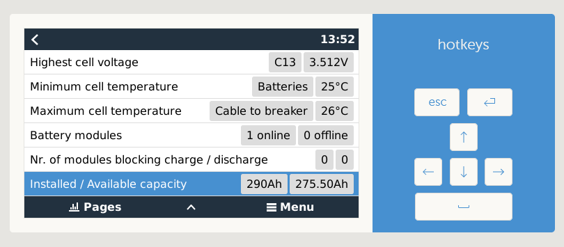
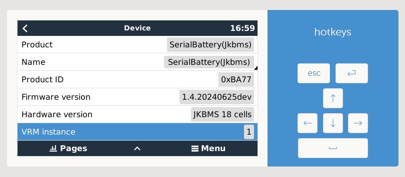

# dbus-serialbattery
This driver is for Venus OS devices (any GX device sold by Victron or a Raspberry Pi running the Venus OS image).

The driver will communicate with a Battery Management System (BMS) that support serial (RS232, RS485 or TTL UART), Bluetooth and CAN communication (see [BMS feature comparison](./general/features#bms-feature-comparison) for details). The data is then published to the Venus OS system (dbus). The main purpose is to act as a Battery Monitor in your GX and supply State of Charge (SoC) and other values to the inverter/charger.

## History
The first version of this driver was released by [Louisvdw](https://github.com/Louisvdw/dbus-serialbattery) in September 2020.

In February 2023 I ([mr-manuel](https://github.com/mr-manuel)) made my first PR, since Louis did not have time anymore to contribute to this project.

With the release of `v1.0.0` I became the main developer of this project. From then on, I have been maintaining the project and developing it further. I'm also solving 99% of the issues on GitHub.

A big thanks to [Louisvdw](https://github.com/Louisvdw/dbus-serialbattery) for the initiation of this project.

## Support this project
This project takes a lot of time and effort to maintain, answering support requests, adding new features and so on.
If you are using this driver and you are happy with it, please make a donation to support me and this project.

## Join the community on Discord
https://discord.gg/YXzFB8rSgx

## Requirements

* GX device or Raspberry Pi running Venus OS version `v2.80` or later.

## Screenshots

### Venus OS

### VRM Portal

