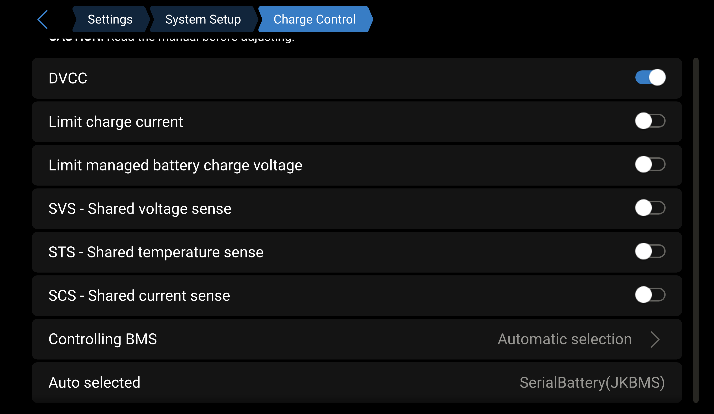

# How to install, update, disable, enable and uninstall

## 🚨 NB! Before you begin 🚨

> The driver does not do any setup of your BMS/battery. You need to have a working battery before you start.

> **Multi battery setup**<br />
>
> In Venus OS only one battery can be selected for controlling CVL, CCL and DCL. This battery then controls the whole system. Also for displaying the battery values in the overview (GUI and VRM) only one battery can be selected. Therefore you need to use a battery aggregator. See [How to aggregate multiple batteries?](../faq/index.md#how-to-aggregate-multiple-batteries)

> The Bluetooth connection is still not stable on some systems. If you want to have a stable connection use the serial connection.

> It is always recommended to use the latest Venus OS version with the latest driver version. To avoid a [white screen](../faq/index.md#fix-white-screen-after-install) after install check the compatibility matrix below.

## Compatibility Matrix

The compatibility between Venus OS and the driver is summarized below:

| Venus OS Version | Driver Version | Driver Runtime <sup>1</sup> | GUIv2 GX Display     | GUIv2 Browser                         | GUIv1 <sup>2</sup>   |
| :--------------: | :------------: | :-------------------------: | :------------------: | :-----------------------------------: | :------------------: |
| v2.9x            | v2.1.x         | OK                          | Unavailable          | Unavailable                           | OK                   |
| v3.0x - v3.4x    | v2.1.x         | OK                          | Unavailable          | Unavailable                           | OK                   |
| v3.5x            | v2.1.x         | OK                          | OK                   | OK                                    | OK                   |
| v3.6x            | v2.1.x         | OK                          | OK                   | OK                                    | OK                   |
| v3.7x            | v2.1.x         | OK                          | OK                   | OK                                    | OK                   |
| Future versions  | v2.1.x         | Very likely OK              | No mods <sup>3</sup> | May not fully functional <sup>4</sup> | May break completely |

<sup>1</sup> **Driver Runtime:** The driver successfully detects the battery and provides correct data to the system.

<sup>2</sup> **Note:** dbus-serialbattery features are not developed for GUIv1 anymore. Switch to GUIv2 for a better experience and new features.

<sup>3</sup> The original GUIv2 will displayed without modifications to ensure functionality.

<sup>4</sup> It could be that some buttons do not work due to Venus OS backend changes.

To see other driver version compatibility, select a driver version in the navigation menu.

## Default driver limits

The driver uses some configurable limits. Ensure your BMS and cells can handle these limits before installation:

| Setting           | Default Value |
| ----------------- | ------------: |
| Charge current    | 50 A          |
| Discharge current | 60 A          |
| Min cell voltage  | 2.9 V         |
| Max cell voltage  | 3.45 V        |

It’s best to set strict (hard) limits for current and voltage directly in your BMS using its own software.

Set the limits in the driver a bit lower (softer limits), so the BMS never has to step in.

You need to set up both your BMS and the driver separately.

These default settings are for LFP (Lithium Iron Phosphate) batteries. If you are using a different cell chemistry, you must update the limits accordingly.

The cell voltages are used along with the cell count to set the battery voltage (e.g., for 16 cells, your battery min voltage will be `2.9 V * 16 = 46.4 V` and max voltage will be `3.45 V * 16 = 55.2 V`).

These limits can be changed in the config file. If you change the cell voltages, also update the cell voltage current limitation (`CELL_VOLTAGES_WHILE_CHARGING` and `CELL_VOLTAGES_WHILE_DISCHARGING`). See [How to change the default limits](#how-to-change-the-default-limits) and [Settings location/path](#settings-locationpath).

## Settings for your BMS/battery

You need to first set up your BMS hardware to match your cells. You would do this, if you build you own battery or your manufacturer/installer have done this for you.

The important steps:

* Use the same cells (type, branch and capacity) and make sure they are balanced.
* You need to correctly set your battery capacity to match the cells you are using. Your SoC calculation in your BMS will be wrong otherwise. If you use `120Ah` cells then your battery capacity will be `120Ah` etc.
* You need to correctly set your min/max cell protection voltages. These are voltages when your BMS will disconnect to protect your cells like `2.85V` and `3.65V`. Your driver limits should be between these and NOT the same.

Check the [How to connect and prepare the battery/BMS](./connect.md) page if you didn't already or for BMS specific settings.

## Install or update

### Install or update automatically with USB/SD card

> 🚨 IMPORTANT! Read the [changelog](https://github.com/mr-manuel/venus-os_dbus-serialbattery/blob/master/CHANGELOG.md) BEFORE updating to a new version.

> It might be, that this doesn't work on older CerboGX devices. In this case use SSH option instead.

1. Download and copy the [latest release](https://github.com/mr-manuel/venus-os_dbus-serialbattery/releases) `venus-data.tar.gz` to the root of a USB flash drive that is in FAT32 format (a SD card is also an option for GX devices, but not for Raspberry Pi).
1. OPTIONAL: Create a `config.ini` file in the root of your USB flash drive with your custom settings. Put `[DEFAULT]` in the first line of the file and add all the values you want to change below. You only have to insert the values you want to change, all other values are fetched from the `config.default.ini`. In the [`config.default.ini`](https://github.com/mr-manuel/venus-os_dbus-serialbattery/blob/master/dbus-serialbattery/config.default.ini) you find all possible settings that you can copy over and change.

   > If you put a `config.ini` in the root of the USB flash drive, then an existing `config.ini` will be overwritten.
1. Plug the flash drive/SD into the Venus device and reboot. It will automatically extract and install to the correct locations and try the driver on any connected devices.
1. Reboot the GX (in the Remote Console go to `Settings` &rarr; `General` &rarr; `Reboot?`).

### Install or update over SSH

> 🚨 IMPORTANT! Read the [changelog](https://github.com/mr-manuel/venus-os_dbus-serialbattery/blob/master/CHANGELOG.md) BEFORE updating to a new version.

> Require [root access](https://www.victronenergy.com/live/ccgx:root_access#root_access)

1. Log into your Venus OS device using a SSH client like [Putty](https://www.chiark.greenend.org.uk/~sgtatham/putty/latest.html) or bash.
2. Run these commands to start the installer.

   ```bash
   wget -O /tmp/install.sh https://raw.githubusercontent.com/mr-manuel/venus-os_dbus-serialbattery/master/dbus-serialbattery/install.sh

   bash /tmp/install.sh
   ```
3. You can now choose which version you want to install:
    1. [Latest release](#latest-release)

       Stable version, tested for more then a week.
    2. [Beta release](#beta-release)

       Beta version, no errors after 72 h runtime, long time testing needed.
    3. [Nightly build](#nightly-build)

       Nightly version, newest features and fixes, bugs possible.
    4. [Specific branch](#specific-branch)

       Nightly version, specific feature testing, bugs possible.
    5. [Specific version](#specific-versiontroubleshooting-option)
    6. [Local tar file](#local-tar-file)

#### Latest release

Stable version, tested for more then a week.

Run the [install script](#install-or-update-over-ssh) and select `1`.

💡 Reboot the system after the installation finished with `reboot`.

#### Beta release

Beta version, no errors after 72 h runtime, long time testing needed.

Run the [install script](#install-or-update-over-ssh) and select `2`.

💡 Reboot the system after the installation finished with `reboot`.

#### Nightly build

Nightly version, newest features and fixes, bugs possible. Please keep your system monitored.

> Not recommended in production environment, unless you know what you do. Testers are very welcome!

Run the [install script](#install-or-update-over-ssh) and select `3`.

💡 Reboot the system after the installation finished with `reboot`.

#### Specific branch

Nightly version, specific feature testing, bugs possible. Please keep your system monitored.

> Not recommended in production environment, unless you know what you do. Testers are very welcome!

Run the [install script](#install-or-update-over-ssh) and select `4`.

💡 Reboot the system after the installation finished with `reboot`.

#### Specific version/troubleshooting option

Run the [install script](#install-or-update-over-ssh) and select `5`. Go to [releases](https://github.com/mr-manuel/venus-os_dbus-serialbattery/releases) and copy the link to the `venus-data.tar.gz` version you like to install. Paste the link with a right click and press enter.

💡 Reboot the system after the installation finished with `reboot`.

#### Local tar file

Place a `venus-data.tar.gz` file in the folder `/var/volatile/tmp/` by copying/uploading it. Run the [install script](#install-or-update-over-ssh) and select `6`.

💡 Reboot the system after the installation finished with `reboot`.

### BMS specific settings

* Daly BMS &rarr; Check [Why is the battery current inverted?](../faq/index.md#why-is-the-battery-current-inverted) and [Daly Lost Connection because of standby](https://github.com/Louisvdw/dbus-serialbattery/issues/731#issuecomment-1613580083)
* ECS BMS &rarr; Check [#254 ECS BMS (comment)](https://github.com/Louisvdw/dbus-serialbattery/issues/254#issuecomment-1275924313)
* Felicity BMS &rarr; You need to set the `BATTERY_CAPACITY` in the `config.ini`
* MNB BMS &rarr; Check [MNB BMS setup](https://github.com/Louisvdw/dbus-serialbattery/issues/590)

You can also get an overview of the BMS specific settings by checking the end of the [`config.default.ini`](https://github.com/mr-manuel/venus-os_dbus-serialbattery/blob/master/dbus-serialbattery/config.default.ini).

### Bluetooth settings

**Get BMS MAC address**

Execute this commands to scan for Bluetooth devices and get their MAC address:

**Command to execute**

```bash
bluetoothctl
```

**Output**

```
Agent registered
[CHG] Controller xx:xx:xx:xx:xx:xx Pairable: yes
```

**Command to execute**

```bash
scan on
```

**Output**

```
Discovery started
[CHG] Controller xx:xx:xx:xx:xx:xx Discovering: yes
[CHG] Device xx:xx:xx:xx:xx:xx RSSI: -60
```

**Command to execute**

```
devices
```

**Output with device MAC addresses**

```
Device xx:xx:xx:xx:xx:xx JK-B2A24S15P
```

**Command to execute**

```
scan off
```

**Output**

```
Discovery stopped
[CHG] Device xx:xx:xx:xx:xx:xx RSSI is nil
[CHG] Controller xx:xx:xx:xx:xx:xx Discovering: no
```

**Command to execute**

```
quit
```

Now you can add the MAC address to the `config.ini`. Check the Bluetooth section in the [`config.default.ini`](https://github.com/mr-manuel/venus-os_dbus-serialbattery/blob/master/dbus-serialbattery/config.default.ini) for more informations.

> If you changed the default connection PIN of your BMS, then you have to pair the BMS first using OS tools like the `bluetoothctl`. The settings PIN is not needed here.
>
> See https://wiki.debian.org/BluetoothUser#Using_bluetoothctl for more details.

Run `/data/apps/dbus-serialbattery/enable.sh` after you added the Bluetooth config to create the needed Bluetooth services.

### CAN settings

Add the CAN port to the `config.ini`. Check the CAN BMS section in the [`config.default.ini`](https://github.com/mr-manuel/venus-os_dbus-serialbattery/blob/master/dbus-serialbattery/config.default.ini) for more informations.

Run `/data/apps/dbus-serialbattery/enable.sh` after you added the CAN config to create the needed CAN services.

## How to change the default limits

Should you require different settings like higher/lower currents or higher/lower min/max cell voltages and your battery can handle that, than you can change it in the settings.

Here an example to set in the `config.ini`:

```ini
MAX_BATTERY_CHARGE_CURRENT    = 50.0
MAX_BATTERY_DISCHARGE_CURRENT = 60.0

MIN_CELL_VOLTAGE   = 2.900
MAX_CELL_VOLTAGE   = 3.450
FLOAT_CELL_VOLTAGE = 3.375
```

For further informations see [Settings location/path](#settings-locationpath) and [How to edit the `config.ini`](#how-to-edit-the-configini).

If you use the cell voltage limits, temperature limits and/or SoC limits you also need to adjust their values to match the new current, else CCL and DCL will not change. See also [Why is the charging/discharging current limit (CCL/DCL) smaller than the set one?](../faq/index.md#why-is-the-chargingdischarging-current-limit-ccldcl-smaller-than-the-set-one).

## Settings for your GX device

**Optional but recommended:**

If you want the driver to control charging voltage, charging current, and discharging current for your chargers and inverters, turn on DVCC.
You can find DVCC under `Settings -> System Setup -> Charge Control`.
- Single battery setup: Make sure that the driver is selected as controlling BMS
- Multi battery setup: Make sure that the battery aggregator is selected as controlling BMS (see also [How to aggregate multiple batteries?](../faq/index.md#dbus-aggregate-batteries-by-dr-gigavolt-recommended))

If DVCC is off, the driver will not control the Victron system, but you can still monitor all values manually.



## Settings location/path

Copy the values you want to change from `/data/apps/dbus-serialbattery/config.default.ini` and insert them in the `/data/apps/dbus-serialbattery/config.ini`.

All available options can also be found [here](https://github.com/mr-manuel/venus-os_dbus-serialbattery/blob/master/dbus-serialbattery/config.default.ini).

## How to edit the `config.ini`

There are two ways to edit the files. You can edit them:

* Directly on the GX device/Raspberry Pi over SSH
* On your PC and then copy only the `config.ini` over to the GX device/Raspberry Pi

### SSH edit using Nano editor (recommended)

Log into your GX device/Raspberry Pi using SSH and run this command:

```bash
nano /data/apps/dbus-serialbattery/config.ini
```

You can use the arrow keys to scroll down and edit the values you need.

Use `Ctrl + O` (O like Oskar) to save and `Ctrl + X` to exit the editor.

💡 After updating the settings, run `/data/apps/dbus-serialbattery/restart.sh` to apply the changes.

If you changed `BLUETOOTH_BMS`, `BLUETOOTH_USE_USB` or `CAN_PORT` reboot to apply the changes.

### Copy edited file from PC to GX device/Raspberry Pi

You can edit the file in a plain text editor on you PC like Notepad (Windows) or TextEdit (macOS). Then you need a program that can do SFTP like [FileZilla](https://filezilla-project.org/download.php?show_all=1) (Windows/macOS/Linux), [WinSCP](https://winscp.net/eng/downloads.php) (Windows) or [Cyberduck](https://cyberduck.io/download/) (macOS).

Connect to your GX using the same login as with SSH and copy your edited file over the existing one at `/data/apps/dbus-serialbattery/config.ini`.

⚠️ Sometimes it happens, that the line endings get changed from `LF` to `CRLF` with this method. Check the [FAQ --> `$'\r': command not found` or `syntax error: unexpected end of file`](../faq/index.md#r-command-not-found-or-syntax-error-unexpected-end-of-file) to solve.

> Don't copy all the files as the required file permissions will be destroyed and your driver might fail to start.

💡 After updating the settings, run `/data/apps/dbus-serialbattery/restart.sh` to apply the changes.

If you changed `BLUETOOTH_BMS`, `BLUETOOTH_USE_USB` or `CAN_PORT` reboot to apply the changes.

## How to enable a disabled BMS

If your BMS is disabled by default, you have to enable it to get it working.

💡 See also [How to edit the `config.ini`](#how-to-edit-the-configini) if you don't know how to edit a file.

Add your BMS to the setting `BMS_TYPE` in the `config.ini`. This way you don't have to enable your BMS after every update.

## Disable the driver

You can disable the driver so that it will not be run by the GX device. To do that run the following command in SSH.

```bash
bash /data/apps/dbus-serialbattery/disable.sh
```

You also need to configure your MPPTs to run in `Stand alone mode` again. Follow the Victron guide for [Err 67 - BMS Connection lost](https://www.victronenergy.com/live/mppt-error-codes#err_67_-_bms_connection_lost).

## Enable the driver

To enable the driver run:

```bash
bash /data/apps/dbus-serialbattery/enable.sh
```

## Uninstall/remove the driver

To uninstall the driver run:

```bash
bash /data/apps/dbus-serialbattery/uninstall.sh
```
