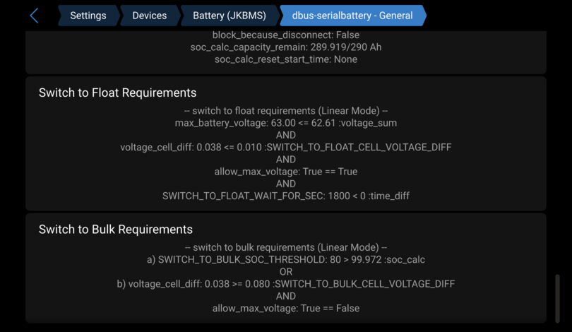

# FAQ (Frequently Asked Questions)

## How to change the default limits

See [this page](../general/install.md#how-to-change-the-default-limits).

## What is the `config.ini` and `config.default.ini`?

The `config.ini` is a file where you can specify your own configuration changes. Like when you want to change default values, e.g. increase the charge and discharge limits. This file is preserved after a version update. Lookup the `config.default.ini` to see which settings are available.

The `config.default.ini` is a file where all possible configuration settings are stored with their default values. Every setting is also well documented in order to understand what the setting does. This file is overwritten every time you update the driver.

Click [here](https://github.com/mr-manuel/venus-os_dbus-serialbattery/tree/v2.0.20250729/dbus-serialbattery/config.default.ini) to see the `config.default.ini`.

## How to edit the `config.ini`

See [this page](../general/install.md#how-to-edit-the-configini).

## How to enable a disabled BMS

See [this page](../general/install.md#how-to-enable-a-disabled-bms).

## What is the username and password of the SSH connection?

See the Victron Energy documentation how to get [root access](https://www.victronenergy.com/live/ccgx:root_access#root_access).

## Which version do I have installed?

You check the installed version in the [driver log files](../troubleshoot/index.md#driver-log-files) or in the remote console/GUI under SerialBattery -> Device -> Firmware version

## How to aggregate multiple batteries?

You need an additional driver for that. Here are a few listed:

### [dbus-aggregate-batteries](https://github.com/Dr-Gigavolt/dbus-aggregate-batteries) by [Dr-Gigavolt](https://github.com/Dr-Gigavolt) (recommended)

Automatically merges connected batteries. Takes consideration of SmartShunt, Multies, Quattros, SmartSolars, BlueSolars and MPPT for current calculation. Additional configuration possible.

💡 Currently the only driver, which switches to float AFTER all batteries are fully charged. See `KEEP_MAX_CVL`, default is `False`.

### [BatteryAggregator](https://github.com/pulquero/BatteryAggregator) by [pulquero](https://github.com/pulquero)

Automatically merges connected batteries. Additional configuration for excluded batteries, total capacity and custom merging possible.

Can be installed through the [SetupHelper](https://github.com/kwindrem/SetupHelper) of [kwindrem](https://github.com/kwindrem).

### [venus-os_dbus-mqtt-battery](https://github.com/mr-manuel/venus-os_dbus-mqtt-battery) by [mr-manuel](https://github.com/mr-manuel)

Virtual battery that has to be fed over MQTT in case you want to merge your data how you'd like. Venus OS Large with Node-RED recommended.

## Why do I need a BMS for lithium batteries?

Lithuim cells are great at storing energy, but they can be dangerous. An overcharged cell can cause a fire. A Battery Management System (BMS) first priority is to protect the cells in your battery from any potential hazards.

The BMS will prevent your battery reaching an unsafe situation (it will disconnect the charge or discharge) and help with the state of each cell inside the battery so that your battery will last longer.

## Which BMS should I buy?

Most of the BMS that the driver support will work fine and the driver does support most features for all the BMS brands. See the [comparison table](../general/features.md#bms-feature-comparison) for any small differenaces.

Find the BMS that fits your budget with the features that you need.

The balancers on Smart Daly BMS don't seem to work that well so many users have opted to add an external balancer to help with that.

Also the way that Daly implemented their communication protocol gives for a much slower data retrial which means slower response to events by the driver.

If you own a Daly, then it will work just fine, but if you still need to buy your BMS then one of the other supported BMS would be a better choice.

## Which serial adapter/cable should I use?

Most USB serial adapters and cables should work fine. You need to use the adapter for the UART type that your BMS use, which is normally TTL, RS232, RS485 or even SPI.

Those adapters based on the **FDTI** or **CH340** chips are the easiest to use because the GX opperating system already include drivers for them.

Cable preferences:

1. Best option is the UART cable/box for your BMS. These use connectors matching your BMS and minimise potential problems with errors from loose connections.
2. Isolated ([galvanic isolation](https://en.wikipedia.org/wiki/Galvanic_isolation)) cables. These are more expensive, but have electrical protection built in making them safer.
3. Any adapter that work with your BMS UART.

> 🚨 **NB! Only connect Rx & Tx or A & B to the BMS,** if you are NOT using an isolated ([galvanic isolation](https://en.wikipedia.org/wiki/Galvanic_isolation)) cable or adapter. This prevents the current to flow through the adapter, if the BMS cuts the ground. Else it will destroy your BMS, GX device or Raspberry Pi.

Recommended adapters that are high quality and have been tested over a long period:
- [USB SinglePort VE.Direct](https://www.duppa.net/product/usb-singleport-ve-direct/?ref=2892) (affiliate link)
- [USB Quadport VE.Direct](https://www.duppa.net/product/usb-quadport-ve-direct/?ref=2892) (affiliate link)

## Which UART connection is the best to use (TTL/RS232/RS485)?

The driver works the same with all the supported UART types. Most BMS will use the `3.3V` TTL (which some would lable as UART) and/or RS485 (`5V`). Victron's VE.Direct is RS232 (`12V`), but not many BMS use that.

You need to match the UART type with what your BMS support.

If the Bluetooth module for your BMS use the UART, then you will need to remove that to plug in your USB adapter, if you do not have another UART available. After your initial setup you do not need the Bluetooth, but you will not be able to connect to it with the phone app.

## Do I need a SmartShunt as well?

No you don't. All BMS do measure the total battery voltage and most do use a shunt to do that already.

The Smartshunt is very well build and most likely better calibrated, but it can only measure the total battery voltage and the current input/output. There are no sensors for the cells inside the battery so the Smartshunt have much less information to work with.

It is best to let the BMS be the Battery Monitor.

You can add both to your system and in the newer Venus OS firmwares you can select to upload both values to the VRM cloud.

## Can the driver be used as monitor only?

> Please also read [Should I set the Smartshunt or the BMS as the Battery Monitor?](../faq/index.md#should-i-set-the-smartshunt-or-the-bms-as-the-battery-monitor)

Select another or `No battery monitor` in the remote console under `Settings -> System setup -> Battery monitor` and another or `No BMS control` in the remote console under `Settings -> DVCC -> Controlling BMS`.

## How can I monitor single cell voltages locally?

To track all cell voltages and/or other data locally you could use Node-RED, InfluxDB and Grafana. This allows you to have offline statistics. See [Track individual cell voltages](https://github.com/Louisvdw/dbus-serialbattery/discussions/495).

## Why no SoC is displayed in the overview page?

Navigate to `Settings -> System Setup` and check that under `Battery monitor` your BMS or battery aggregator is selected.

## Should I set the Smartshunt or the BMS as the Battery Monitor?

Set the BMS as the Battery Monitor of your system so that it can read the alarm and cell data to manage your GX system. If you don't, then these alarms will be ignored and the system will keep on (dis)charging the battery even if a problem alarm is raised. The BMS will react by disconnecting the battery for protection and your inverter will go offline.

## Why is the max cell voltage set to `3.45V`?

Most home power systems use LiFePo4 cells that are `3.2V`. This explanation is the same but with different voltages for a `3.7V` cell system.

The default `MAX_CELL_VOLTAGE` and `MIN_CELL_VOLTAGE` that is set in the driver is to get your battery to full charge without any cell going into protection. This is used to calculate the max voltage for the battery that we ask the chargers to charge the battery too.

`3.65V` will be the protection voltage of a cell for most BMS while `3.45V` is considered full charge.

If you set your charger to aim for `3.65V` it means you are aiming to reach the protection voltage (which it will, and raise an alert). Even `3.64V` is too close.

If you look at your cells you will see that it takes hours of charging to go from `3.2V` to `3.4V`, but from `3.45V` to `3.6+V` can be in just a second. This give no time for balancing to kick in, thus one cell will reach `3.65V` while most of the rest will still be around `3.45V` (assuming all your cells are closely balanced. This is much worse if they are not). This all gets multiplied by the cell count that you have.

An example might help (using a 8 cell battery):

- If we aim for `3.45V` per cell that will tell the charger to charge to `27.60V` (`3.45V x 8`)
- If we aim for `3.64V` per cell that will tell the charger to charge to `29.12V` (`3.64V x 8`)

Now say all our cells are almost full. That would mean they are close to `3.45V` or `27.6V` while we are requesting the battery to go up to `29.12V` or another `1.52V`.

The first cell that is a bit more full than the rest will jump from `3.45V` to `3.65V` and raise an alarm, but it is only an increase of `0.2V` which mean while one cell should be protected we are asking the charger to increase the voltage another `1.32V` cause it thinks we are not full yet.

If this continues the BMS will disconnect and your power will trip.

Now, if you still do want to aim for `3.65V` per cell you will have to change the setting on your BMS so that the BMS protection only kick in at a higher voltage (e.g. `3.85V`), but I WOULD NOT RECOMMEND THIS, if you want your battery to last a long time.

You get most of the power from the cells between `3.1V - 3.45V` and you will have less issues.


## Why is the charging/discharging current limit (CCL/DCL) smaller than the set one?

The limits are based on percentages of `MAX_BATTERY_CHARGE_CURRENT` and `MAX_BATTERY_DISCHARGE_CURRENT` values, so there is no need for additional modifications. Additionaly you see in the remote console/GUI under `SerialBattery` → `Parameters` why it's limited.


## Why is the displayed charging/discharging current limit (CCL/DCL) not applied?

Navigate to `Settings -> System Setup -> Charge Control`, check that `DVCC` is enabled and that under `Controlling BMS` your BMS or battery aggregator is selected. On this page normally only `DVCC` should be enabled.

## Why is my battery not switching to float/bulk?

Make sure you have set this options in the `config.ini`:

```ini
GUI_PARAMETERS_SHOW_ADDITIONAL_INFO = True
CVCM_ENABLE = True
```

Go to the remote console/GUI under `Settings -> Devices -> SerialBattery -> dbus-serialbattery - General` and go to the bottom. Here you see the requirements which are met/not met to do the switch.

If the `voltage_sum` does not reach or exceed `max_battery_voltage` then you can try to enable `SVS - Shared voltage sense` in the remote console/GUI under `Settings -> System Setup -> Charge Control`. If that still does not help, check the `VOLTAGE_DROP` parameter in the [`config.default.ini`](https://github.com/mr-manuel/venus-os_dbus-serialbattery/tree/v2.0.20250729/dbus-serialbattery/config.default.ini).




## Does the driver work for `3.7V` based cells also?

Yes, but you will [need to adjust](../general/install.md#how-to-change-the-default-limits) the `MAX_CELL_VOLTAGE` and `MIN_CELL_VOLTAGE` values for `3.7V` cells instead of the default `3.2V` cells.

Recommended values for `3.7V` cells are:

```ini
MAX_CELL_VOLTAGE = 4.0
MIN_CELL_VOLTAGE = 3.6
```

## Why do I get a Low Voltage alarm?


NOTE: Below the alarm message, you can see which device triggered the alarm.

You may encounter this error from the MultiPlus/Quattro in two scenarios:

1. The controlling battery sets the `DCL` (Discharge Current Limit) to `0`, which also triggers `Allow to discharge` to be set to `No`.
2. The controlling battery is no longer available and has disappeared from the devices list. Refer to the [How to troubleshoot](../troubleshoot/index.md) page to identify the cause.

This triggers the alarm from the MultiPlus/Quattro and puts the inverter into passthrough mode (when grid connected) or turns the inverter off (when off-grid). This is the default behavior in Venus OS and cannot be changed, as the battery is empty and the system cannot use the battery anymore.

See also:

- [Low Battery Voltage Alarm if /Info/MaxDischargeCurrent = 0](https://github.com/Louisvdw/dbus-serialbattery/issues/407)
- [Undervoltage alarm - why?](https://github.com/Louisvdw/dbus-serialbattery/issues/363)

## Why do I get a high voltage alarm?

If you receive high voltage alarms that would indicate your battery is:

1. Not set up correctly and you are using the wrong charge voltages
2. It has cell imbalance issues

So asuming you have set the max battery voltage for what the battery require, you then need to help the battery to get the cells balanced. You do that by  lowering the max voltage to a level where you don’t get high voltage alarms anymore and then slowly over a few weeks you can increase the max voltage to where it should be. This will give the balancers time to work.

In your GX settings go to the DVCC menu and activate the "Limit managed battery charge voltage" feature and lower the "Maximum Charge Voltage".

Drop your voltage to `0.2V` lees that normal and then increase it every day by `0.05V` if you did not get a high voltage alarm during the previous day. If you did get an alarm leave it unchanged for another day.

Do this until you get to the original max charge voltage for your battery.

This will be much faster to do if you use the Keep Batteries changed in ESS option while you are doing this.

Balancing works when ever 1 cell go above the balance threshold, so you are trying to find the battery voltage where that one cell is above the threshold but below the high voltage alarm (e.g. `3.45V - 3.65V`) and then giving the balancers time to work down the high cell with the small balance currents (`50mA` to `200mA`).

### Daly BMS - High voltage alarm

For a high voltage alarm on Daly BMS check also [Daly BMS - High voltage alarm](https://github.com/Louisvdw/dbus-serialbattery/issues/653).

The Daly BMS alarms did not work in driver versions before `v1.0.20230531` and therefore in 99% of the cases the BMS is not setup correctly.

## Why is the battery current inverted?

Some Daly BMS send the current as inverted value. This can be corrected by setting `INVERT_CURRENT_MEASUREMENT` to `-1` in the `config.ini`. See [How to edit the `config.ini`](../general/install.md#how-to-edit-the-configini).

## What can I do, if the BMS communication is unstable?

Most unstable communications arise due to:

- **Cabling:** Check that your serial cables are not too short (< 30 cm). Sometimes this also creates problems.
- **Cabling:** Check your cables again and make sure that all solder points are making good connection.
- **Cheap USB Hubs:** Make sure you are using a qualitative USB Hub with enough power.
- **Damaged/Defective serial adapters:** Try another serial adapter.
- **Missing shielded cable:** If your serial cable is near or along the battery power cable, then try to use a shielded cable or move the cable.
- **Raspberry Pi:** Do not use a charger for powering the Raspberry Pi. Instead buy a power supply with enough power.

## How to troubleshoot a slow system?

### Dbus roundtrip time

Check the dbus roundtrip time on the VRM portal:

1. Open your installation on the [VRM portal](https://vrm.victronenergy.com).
2. Go to **Advanced** (left navigation bar).
3. Click **Widgets** (top right settings icon).
4. Select **Custom Widget** and click **Create custom widget**.

    **Widget name:** dbus roundtrip time

    **New device:**
    - Device: Gateway
    - Parameter: D-Bus Round-trip time (ms)

If the D-Bus roundtrip time is always above **50 ms**, your system may start having problems.
If it is above **100 ms**, the system is too slow to respond and can become unstable.

If you see high values, your system might have high CPU load. See the [CPU load](#cpu-load) section for troubleshooting steps.

### CPU load

The easiest way to troubleshoot high CPU load is to use `htop`. Since `htop` is not available on Venus OS you have to install it first. See [here](https://github.com/mr-manuel/venus-os_helpful-scripts/tree/master/htop/armv7) or use `opkg` to install it (if you know what you do).

Once installed open `htop` and sort by CPU time. To do this press `F6`, then select `Time`and hit `Enter`. Now the process that uses the most CPU time is at the top.

Top exit `htop` press `q` or `CTRL + C`. After exiting you will see a few warnings, which you can ignore.

### Unexpeted system reboot (watchdog)

If your system is rebooting multiple times a day, then it's very likely that the watchdog triggers a reboot.

You can check this by executing this command:

```bash
cat /var/log/messages* | grep watchdog
```

If there is no output, your system did **not** restart due to high load.

If you see lines like the following, your device **was** rebooted because the load average was too high:

```
Jun  3 11:15:32 ekrano daemon.err watchdog[400]: loadavg 10 10 7 is higher than the given threshold 0 10 6!
Jun  3 11:15:32 ekrano daemon.err watchdog[400]: repair binary /usr/sbin/store_watchdog_error.sh returned 253 = 'load average too high'
Jun  3 11:15:32 ekrano daemon.alert watchdog[400]: shutting down the system because of error 253 = 'load average too high'
Jun  3 11:15:32 ekrano daemon.err watchdog[31871]: /usr/sbin/sendmail does not exist or is not executable (errno = 2)
```

To further check which process had a high CPU usage at that time check the logfile that is written at the moment of the watchdog trigger:

```bash
head /data/log/watchdog_processlist.txt
```

## Why do I have a high CPU usage after installing the driver?

The driver polls a lot of data every second (for most BMS), which also has to be elaborated. Additionaly the more BMS and USB to serial adapter you have connected, the bigger the load.

If your system cannot handle this and reboots often (check with `uptime` how long the system is up), try to set the `POLL_INTERVAL` in the `config.ini` to `2` and then increase this value by `1`, until the CPU overload is fixed. `POLL_INTERVAL` defines how often the data is polled from the BMS.

Keep in mind, that the battery data is then refreshed less often and which can cause system instabilities. In this case you have to try and see which value works best for you.

## How can I reset the SOC to 100%?

See the SOC sections on the [features page](../general/features.md#soc-reset-voltage).

## Why is my `config.ini` always reset to default values?

Probably you forgot to remove the USB/SD card with the `venus-data.tar.gz` after successful installation. Please delete the file or remove the USB/SD card. This is fixed with `>= v1.0.20230512`.

## Why is the custom name lost after a reboot?

This feature is only available in and after `v1.0.20230724beta`.

## Fix white screen after install

Normally this will happen, if you were on an older firmware for your GX.

You can remove the GUI changes or update your GX firmware to solve this.

### Remove GUI changes

Execute the command below to restore the GUI.

```bash
bash /data/apps/dbus-serialbattery/restore-gui.sh
```

### Update to the latest firmware

If the removal of the GUI changes did not help, you can force a reinstall/update of the firmware. This takes about 5-15 minutes depending on your device and internet connection.

```bash
/opt/victronenergy/swupdate-scripts/check-updates.sh -update -force
```

If this also did not help then execute this command to prevent any driver to auto install after firmware update.

```bash
mv /data/rc.local /data/rc.local.backup
mv /data/rcS.local /data/rcS.local.backup
```

Now run again the reinstall/update of the firmware.

## How many USB to serial adapters can I connect?

It seems that the Victron GX device has a limit of maximum 8 USB to serial adapters. See [Serial battery driver not found if other VE.direct-USB devices are present](https://github.com/Louisvdw/dbus-serialbattery/issues/422)

## `$'\r': command not found` or `syntax error: unexpected end of file`

This indicates, that the line endlings were changed during the upload from `LF` to `CRLF`. Run this commands to repair the files:

```bash
sed -i 's/\r//' /data/apps/dbus-serialbattery/*.sh
sed -i 's/\r//' /data/apps/dbus-serialbattery/*.py
sed -i 's/\r//' /data/apps/dbus-serialbattery/service/run
sed -i 's/\r//' /data/apps/dbus-serialbattery/service/log/run
```

Now reboot the device. If this doesn't help, then download/unpack and reinstall the driver again.
